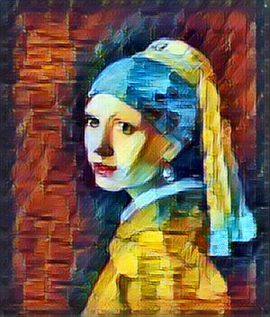

# 30-Days-of-Udacity-for-Deep-Learning-Nanodegree
This repository is used to keep track of all the learning through out the nanodegree program including projects I completed and progress I made each day towards my pledge of 30 Days of Udacity

**Day 1 (10th. Sept, 2019):**
1.  Surveyed the course.
2.  Pledged for 30 Days of Udacity https://www.screencast.com/t/DLhH4qnF

**Day 1 (13th. Sept, 2019):** starting off again as I missed 2 days due to some work commitments :worried:  
1. I needed a quick refresher of how Ananconda works so I completed [Anaconda and Jupyter Notebooks course by Udacity](https://classroom.udacity.com/courses/ud1111) here is the screenshots of it: [Lesson 1](https://www.screencast.com/t/MB2J1f0C), [Lesson 2](https://www.screencast.com/t/77MBfMYAPt)

**Day 2 (14th. Sept, 2019):**  
Reached to Lesson 6 of Into to Deep Learning https://prnt.sc/p6ewt5 

**Day 3 (15th. Sept, 2019):**  
1. Used style transfer from https://github.com/lengstrom/fast-style-transfer to transfer style of _rain pricess_ image to content of _girl with pearl earring_ image. #MadeWithUdacity  
   

