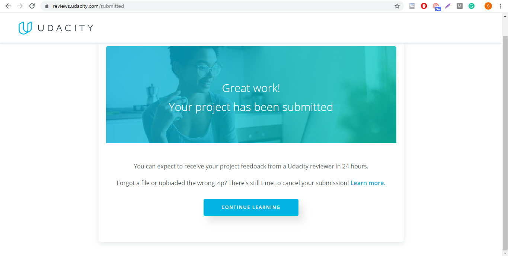

# 30-Days-of-Udacity-for-Deep-Learning-Nanodegree
This repository is used to keep track of all the learning through out the nanodegree program including projects I completed and progress I made each day towards my pledge of 30 Days of Udacity

**Day 1 (10th. Sept, 2019):**
1.  Surveyed the course.
2.  Pledged for 30 Days of Udacity https://www.screencast.com/t/DLhH4qnF

**Day 1/30 (13th. Sept, 2019):** starting off again as I missed 2 days due to some work commitments :worried:  
1. I needed a quick refresher of how Ananconda works so I completed [Anaconda and Jupyter Notebooks course by Udacity](https://classroom.udacity.com/courses/ud1111) here is the screenshots of it: [Lesson 1](https://www.screencast.com/t/MB2J1f0C), [Lesson 2](https://www.screencast.com/t/77MBfMYAPt)

**Day 2/30 (14th. Sept, 2019):**  
Reached to Lesson 6 of Into to Deep Learning https://prnt.sc/p6ewt5 

**Day 3/30 (15th. Sept, 2019):**  
1. Used style transfer from https://github.com/lengstrom/fast-style-transfer to transfer style of _rain princess_ image to content of _girl with pearl earring_ image. #MadeWithUdacity  
   

**Day 4/30 (16th. Sept, 2019):**  
1. Completed Intro to Deep Learning Lesson https://www.screencast.com/t/sSMfBavk
2. Watched video provided by mentor @Neelansh Sahai: https://youtu.be/aircAruvnKk to get basic intuition about Neural Networks.

**Day 5/30 (17th. Sept, 2019):**  
Took day off

**Day 6/30 (18th. Sept, 2019):**  
Completed revision of Lesson: Intro to Neural Network uptil video 22 - Multiclass Cross Entropy 

**Day 7/30 (19th. Sept, 2019):**  
Completed revision of Lesson: Intro to Neural Network

**Day 8/30 (20th. Sept, 2019):**  
Completed Lesson: Backpropagation
https://prnt.sc/p97mik

**Day 9/30 (21st. Sept, 2019):**  
Started practicing coding problems related to Numpy on hackerrank, earned 4th star for it :blush:  https://www.screencast.com/t/SNBrorLq

=============================

 ## RESTARTING 30 Days of Udacity Pledge 
As they say 
> "Fall down seven times, stand up eight"

I had a serious family emergency which compelled me to stop all my activities and focus on that situaton only, now I am restarting my pledge, commiting to start my learning more effectively than before.  

**Day 1/30 (13th. Oct, 2019):**  
1. Restarted pledge of 30 days of Udacity.

2. Completed and submitted first project "Predicting Bike Sharing Patterns" 

3. Read and got inspired from amazing [interview of Google AI's Maya Gupta](https://mlatgt.blog/2019/05/21/9-questions-with-google-ais-maya-gupta-teaching-computers-to-gamble-well-knowing-how-to-play-the-career-game-and-a-solution-to-boring-plane-rides/)

**Day 2/30 (14th. Oct, 2019):**  
1. Started Lesson 6: Sentiment Analysis, completed miniproject 1 (Curating dataset and validating predictive theory)

**Day 3/30 (15th. Oct, 2019):**  
1. Completed miniproject 2 from Lesson 6: Sentiment Analysis (Transforming text into numbers)

**Day 4/30 (16th. Oct, 2019):**  
1. Stuck at miniproject3 from Lesson 6: Sentiment Analysis (Building Neural Network)

**Day 5/30 (17th. Oct, 2019):**  
1. Still stuck at miniproject3 from Lesson 6: Sentiment Analysis (Building Neural Network)

**Day 6/30 (18th. Oct, 2019):**  
1. Managed to find what was broken in my implementation of  miniproject3 from Lesson 6: Sentiment Analysis (Building Neural Network)

**Day 7/30 (19th. Oct, 2019):**  
1. Completed miniproject 4 and 5 from Lesson 6: Sentiment Analysis (Building Neural Network), posted questions I had in Developer Circles: Deep Learning Nanodegree Recipients Group: https://www.screencast.com/t/QGYjsmnd

**Day 8/30 (20th. Oct, 2019):**  
1. Understood miniproject 6 from Lesson 6: Sentiment Analysis (Building Neural Network), will code day after tomorrow.

**Day 9/30 (20th. Oct, 2019):**  
1. Completed Lesson 6: Sentiment Analysis (Building Neural Network)

**Day 10/30 (20th. Oct, 2019):**  
1. Completed 10 videos from Lesson: 7 Deep Learning with Pytorch, started working on MNIST dataset

## RESTARTING 30 Days of Udacity Pledge for the third time

**Day 1/30 (31st. Oct, 2019):**  
 - Completed Lesson 7 Deep Learning with Pytorch
 

**Day 2/30 (1st. Nov, 2019):**  
Completed 10 videos of Lesson 1 Convolutional Neural Network 

 **Day 3/30 (2nd. Nov, 2019):**  
- Completed next 10 videos of Lesson 1 Convolutional Neural Network 
- Answered a query in Deep Learning channel.

**Day 4/30 (3rd. Nov, 2019):**  
Finally Completed Lesson 1 Convolutional Neural Network, worked on CIFAR-10 toy dataset.

  

## RESTARTING 30 Days of Udacity Pledge for the fourth time

**Day 1/30 (8th. Nov, 2019):**  
- Completed Lesson 3 Transfer Learning of Part Convolutional Neural Network

**Day 2/30 (9th. Nov, 2019):**  
- Completed Lesson 4 Weight Initialization Part Convolutional Neural Network

**Day 3/30 (10th. Nov, 2019):**  
- Completed Lesson 5 Autoencoders Part of Convolutional Neural Network, worked on Linear Autoencoders for data compression and descompression (encoders with all linear layers in encoder and decoder parts), worked on Convolutional Autoencoders for data compression and descompression and well as denoising images.

**Day 4/30 (11th. Nov, 2019):**  
- Started Lesson 6 Style Transfer Part Convolutional Neural Network, watched first 4 videos

**Day 5/30 (12th. Nov, 2019):**  
- Completed Lesson 6 Style Transfer Part Convolutional Neural Network, worked on Style Transfer notebook and transferred style of one image to content of another image.

**Day 6/30 (13th. Nov, 2019):**  
- Started Dog Breed Classifier Project, just got overview of project details, rubric and started the project and just completed part 1 of the project today, feeling a bit overwhelmed, will work towards it more tomorrow.

**Day 7/30 (14th. Nov, 2019):**  
- Still working on project "Dog Breed Classifier" , tried working with dlib library, running into issues, will look into it tomorrow.

**Day 8/30 (15th. Nov, 2019):**  
- Still working on project "Dog Breed Classifier" , my own dog breed classifier didn't acheive more than 10 percent accuaracy, struggling to make it work.

**Day 9/30 (16th. Nov, 2019):**  
- Still working on project "Dog Breed Classifier" , found the issue I didn't normalize test data and that was causing issue of acheiving more than 10 percent accuaracy, wasted more than 5 GPU hours, too tired to go on, now will resume work tomorrow.

**Day 10/30 (17th. Nov, 2019):**  
- Still working on project "Dog Breed Classifier" , acheived only 57 percent accuracy on my tansfer learning based dog breed classifier, I only changed number of output in pretrained network, spent 5 hours on it.Now I will use an added linear layer and train network tomorrow.

**Day 11/30 (18th. Nov, 2019):**  
- Finally completed project Dog Breed Classifier !!! Phew!! that took alot of time, now reading section "Jobs in Deep Learning"

**Day 12/30 (19th. Nov, 2019):**  
- Took a day off

**Day 12/30 (20th. Nov, 2019):**  
- Completed half of Lesson 1 of Part "Recurrent Neural Networks"

**Day 13/30 (21st. Nov, 2019):**  
- Completed 3 videos of Lesson 1 of Part "Recurrent Neural Networks"

**Day 14/30 (22nd. Nov, 2019):**  
- Completed all of Lesson 1 of Part "Recurrent Neural Network

**Day 15/30 (23rd. Nov, 2019):**  
- Completed of Lesson 2 (LSTM) of Part "Recurrent Neural Network

**Day 16/30 (24th. Nov, 2019):**  
- started off Lesson 3 (Implementation of RNN and  LSTM) of Part "Recurrent Neural Network, stopped lesson at Character wise RNNs.

**Day 17/30 (25th. Nov, 2019):**  
- Completed Lesson 3 (Implementation of RNN and  LSTM) of Part "Recurrent Neural Network

**Day 18/30 (26th. Nov, 2019):**  
- Completed Lesson 4 "Hyperparameters" of Part "Recurrent Neural Network

**Day 19/30 (27th. Nov, 2019):**  
- Started Lesson 5 "Embeddings and Word2Vec" of Part "Recurrent Neural Network -Completed first five videos, started understanding 1st notebook of this lesson.

**Day 20/30 (28th. Nov, 2019):**  
-Completed 10 videos of  Lesson 5 "Embeddings and Word2Vec" of Part "Recurrent Neural Network - stuck at 10th video, starting it difficult, will restart tomorrow.

**Day 21/30 (29th. Nov, 2019):**  
-Took off.

**Day 22/30 (30th. Nov, 2019):**  
- Completed Lesson "Embeddings and Word2Vec" of Part "Recurrent Neural Network

**Day 23/30 (1st. Dec, 2019):**  
- Completed Lesson "Sentiment Prediction RNN" of Part "Recurrent Neural Network

**Day 24/30 (2nd. Dec, 2019):** TILL **Day 24/30 5th. Dec, 2019):**  
I had to take a break, intense fever and flu with a cyst on my left leg stopped me from any activity except for eating, sleeping and going to the restroom. (counting it as one day of 30 days but will overcome it with the rest of the days left. 

**Day 25/30 (6th. Dec, 2019):**  
Started working on Project "TV Script Generation", so far it is easy project, I am using Google Colab for this project to save Udacity's account GPU hours. Stopped at the step "Building Network"

**Day 26/30 (7th. Dec, 2019):**  
- Resumed work on project.
- Completed and submitted project "TV Script Generation"

**Day 27/30 (8th. Dec, 2019):**  
Started Lesson 5 "GAN"

**Day 28/30 (9th. Dec, 2019):**  
Still stuck at understanding GAN architecture, little hard to grasp the concept of 2 network working against each other, their cost functions are really confusing

**Day 29/30 (10th. Dec, 2019):**   
Completed first lesson of part Generative Adverserial Network, worked on implementing basic Generative Adverserial Network using only  linear layers in  Generator and Discriminator model. [Exercise Link](https://github.com/Sidrah-Madiha/30-Days-of-Udacity-for-Deep-Learning-Nanodegree/blob/master/Exercises/MNIST_GAN_Exercise.ipynb)

**Day 30/30 (11th. Dec, 2019):**   
Completed first 7 videos of Lesson 2 "Deep Convolutional GANs" of Part "Generative Adverserial Network", understood [Benefits of Batch Normalization](https://github.com/Sidrah-Madiha/30-Days-of-Udacity-for-Deep-Learning-Nanodegree/blob/master/Exercises/Batch_Normalization.ipynb)

## Another round of 30 Days of Udacity

**Day 1/30 (12th. Dec, 2019):**   
- Took pledge for 30 Days of Udacity
-  Completed Lesson 2 "Deep Convolutional GANs" of Part "Generative Adverserial Network".
- Worked on [exercise](https://github.com/Sidrah-Madiha/30-Days-of-Udacity-for-Deep-Learning-Nanodegree/blob/master/Exercises/DCGAN_Exercise.ipynb) that teaches to create a Street View Housing Number Generator using Deep Convolutional GANs .
I encourage @PawanB and myself to keep going, #FinalDaysof2019 #30DaysofUdacity 

**Day 2/30 (13th. Dec, 2019):**   
- Earned badge from Udacity for completing #30DaysofUdacity  :relaxed: :blush: :relieved:

- Also my name was listed on honorable mentions wall. :relaxed: :blush: :relieved: :high_brightness:
 

- Completed Lesson "Pix2Pix and CycelGAN"  of Part "Generative Adverserial Network".
I encourage @FridaR and @THIYAGARAJANR

**Day 3/30 (14th. Dec, 2019):**  TO **Day /30 (16th. Dec, 2019):** 
- Started CycleGAN implementation for translating images from Summer to Winter and vice versa, I coded it in Udacity workspace but for running on GPU, started GoogleColab.

**Day 4/30 (15th. Dec, 2019)**
- Spent the day while fixing error on Google Colab related issues, like importing custom modules etc.

**Day 5/30 (16th. Dec, 2019)**
- Finally ran training for CycleGAN implementation, the results showed no change, turned out I had wrong variable returning in one of the function, fixed it and my [exercise of CycleGAN implementation for translating images from Summer to Winter and vice versa](https://github.com/Sidrah-Madiha/30-Days-of-Udacity-for-Deep-Learning-Nanodegree/blob/master/Exercises/CycleGAN_Exercise_untrained.ipynb) is completed
 I encourage @THIYAGARAJANR  @Ahmad SiarM @Paul BruceS #FinalDaysof2019 #30DaysofUdacity

